# McHome - Overview
McHome is a web application of recipes for students with little time. It is developed with "Human-computer interaction" techniques, during four phases, called milestones:
1. Needfinding
2. Prototyping and Heuristics
3. Wireframe
4. Usability Testing
Every phase is described in the document below.

This web application was created for the "Human Computer Interaction" course at Politecnico di Torino. It was awarded with full marks.
It is implemented with JS and the React-Bootstrap framework.

## Building instructions
In the main folder:
```
cd client
npm install
npm start
cd ..
cd server
npm install
nodemon server.js
```

## Final results
The final results are the following:

# Milestone 1: Project description and Needfinding

## Overview and planning
Our group wants to observe the process that university students go through when planning their meals. We focused on situations where they have a short amount of time for planning, preparing and eating the meal. Additionally, we would like to understand how healthy the students perceive their meals and if they would like to improve this aspect.

Our focus is off-site students, both Italian or international because they have to prepare their meals by themselves.

Furthermore, we decided to categorize them based on their cooking skills and their off-site experience. Thus, we are going to observe:

- two new to cooking students: never cooked meals alone before the current academic year
- two already used to cooking students (one of them being an international student)

We wanted to observe both new to cooking and experienced ones because their experience in managing time and ingredients could be different.

The selection of an international student was made thinking about the extra difficulties they might have based on different cultural backgrounds. Thus, they might have more problems with the ingredients selection.

These observations allowed us to comprehend the cooking preparation habits of students: time management, ingredients' shopping, meal decision, ingredients usage... Thus, we're able to validate the necessities of the students we thought to exist previously that were the centre of our project idea. This is because we want to provide students with a tool to help them prepare quick and healthy meals with the ingredients they have available at home. 


## Observation
### João - Experienced cooking student 

João is an international student in his last year of studies. He has been an offsite student for the whole duration of his career. Thus, he already has a good cooking experience.
In the observation, we were able to see that the place where the student cooks is small. In the cooking preparation, he gathered all the ingredients and tools needed to start cooking the meal, showing that he is organized when cooking. When retrieving the ingredients for the meal, we could observe that neither the fridge nor the pantry of the student was very full. This might indicate that the student doesn't do a lot of advanced planning of his meals.

The meal preparation took about 25min.

### Paolo - New to cooking student 

On the day of the interview, in the morning, paolo had class so he took some ingredients right away before returning home. He has a grocery list on his phone to don't forget anything when he goes shopping.
Paolo is not yet a capable cook. Thus, he often cooks the same recipes using the same ingredients. He mentioned that he is cooking with the identical ingredients as the day before. This way, except for one or two purchased before, he had all the ingredients available at home. However, he also said that he would like to improve the lack of variety of ingredients. Excluding weekends, he feels that he often doesn't have time to try something new.

His meal preparation took about 20 min.

### Alessia - New to cooking student 
Alessia is an Italian student who decided to enrol in Politecnico of Turin last year for her master's degree. She has been an off-site student for a year because she attended a university that is very close to her place for her three-year degree. However, she is not used to cooking now, even if she has one year of experience. 

The observed student seems to be organized, at first glance: she had all the needed ingredients in her fridge so she didn't have to go shopping for something missing. She decided what to eat right before starting to cook and without opening the fridge to see what was available. She prepared pasta with pesto and took 15 minutes to prepare her whole meal, 5 minutes to boil the water and 10 to cook pasta and dress it with pesto. She was happy about that because she could also rest a little bit before coming back to class. 
What it was possible to observe in her pantry is that there is a lot of rice, pasta, tuna and a set of different sauces. All lead to say that the student prefers to cook easy meals and the biggest priority is to spend a small amount of time. 

### Ramon - Experienced cooking student 

Ramon is an Italian student in his last year of studies. He has been living alone for some years and he's used to cooking his meals by himself. He has a daily plan with a well-defined list of ingredients.

It was possible to observe that as a used-to cooking student, he has already-prepared ingredients stored in the fridge to prepare his meal. Furthermore, he already had everything he needed to start cooking. 
Another observation made was that in the pantry, he stores a large amount of dry food.

His meal preparation took about 25min.


## Interviews
### Questions

1. Do you plan your meals? 

> João: He doesn't plan his meals but he shops weekly for ingredients that can be used for meals.

> Paolo: Yes, he does. Even if it's his first year living alone, Paolo is a well-organized student. He searches online for available offers in the grocery shop near his house and selects the discounted ingredients he likes.

> Alessia: She doesn't plan very much because she often eats the same things. She usually goes shopping twice a month and buys all she needs for preparing these meals. This way, she often has almost everything in her fridge.

> Ramon: He plans his meals because sometimes he brings food with him to the university and other times he goes to the canteen

2. <em>[Optional: if they plan their meals]</em> How much time before each meal?

> Paolo: He decides what to eat early in the morning after breakfast.

> Ramon: He plans his meals the day before

3. <em>[Optional: if they don't plan their meal]</em> When do you choose what to eat?

> João and Alessia: Right before the meal

4. <em>[Optional: if they don't plan their meal]</em> If you don't have all the ingredients at home, how do you solve this issue?

> João: Because he usually decides right before cooking, he simply chooses his meal based on the ingredients available. Rarely he goes shopping before cooking.

> Alessia: It hardly ever happens, but when it does she usually changes her plans and eats something else using the ingredients that she has available.

5. How much time do you usually take to cook the food? 

> João: Usually takes 30min opting for simple meals.

> Paolo: He usually takes between 20 and 30 minutes to prepare his meal.

> Alessia: She prepares only super easy recipes that require 15 minutes for lunch and 30/45 minutes for dinner.

> Ramon: He usually spends not more than 30 minutes preparing his meals. 

6. How hard is it for you to cook your meal with the time you have available? Very hard? Hard? Ok? Simple? Very simple?

> João: Ok.

> Paolo: Time management for him is ok. The problem is that sometimes cooking takes longer than he expected so he happens to be late.

> Alessia: Pretty simple

> Ramon: Simple

7. How hard is it for you to come up with the recipe for the meal? Very hard? Hard? Ok? Simple? Very simple?

> João: Simple.

> Paolo: Simple. He's used to cooking the same ingredients, so it's not hard for him to come with a recipe.

> Alessia: Simple, since she always does the same dishes. She rarely buys seasonal vegetables that she doesn't know how to cook and searches for recipes on the Internet.  

> Ramon: Simple, He has a nutritional diet and so he has a daily plan. He has a well-defined list of ingredients that he's used to cooking so he doesn't find it hard to come up with a recipe.

8. Do you think that the recipes you find in the books or online are too difficult or time consuming for you?

> João: He doesn't find it very hard to find recipes to cook nor to find the ones he needs online.

> Paolo: Sometimes, the recipes that he finds online are too difficult and time-consuming.

> Alessia: She tries to find some recipes on the Internet but she finds that they require more time than she can or wants to spend.

> Ramon: He finds that online recipes are usually time-consuming.

9. Would you like to improve the variety of dishes that you eat?

> João: Yes, he would like to.

> Paolo: Yes, he'd like to cook something different sometimes.

> Alessia: Yes, she would like to, but new recipes always seem very difficult for a new learner like her. 

> Ramon: Sometimes yes.

10. When you cook your meal at home, how healthy do you think your recipes are? On a scale from 1 to 5 (1 being the least healthy)

> João: Healthwise, he rates his meals as a 3/4.

> Paolo: He said 3 out of 5. He thinks that most of his meals are healthy but not all of them.

> Alessia: 4, she thinks that she eats quite healthy.

> Ramon: 5. They are very healthy because he prepared them at home with all the ingredients from his diet.

11. <em>[Optional: if they don't think their meals are very healthy]</em> Would you like to improve your diet so it can be healthier?

> João: Yes, maybe sometimes he would like to choose something healthier.

> Paolo: Yes, he'd like to, but laughing he said that healthy recipes usually take a long time to do.

12. How often does it happen to you to let ingredients go out of time?

> João: Too often. The biggest issue he pointed out was the amount of food he feels that he lets go to waste.

> Paolo: It's not so often that he lets the ingredients go out of time, but sometimes happens.

> Alessia: Not often, she is getting better. She said that she tries to not waste food by putting ingredients that are easier to forget in the front of the fridge.

> Ramon: He doesn't waste food because he buys it weekly knowing what he's going to eat.

## Diary
Student days can vary a lot since their schedule changes daily. To better understand their needs, we decided to deepen our knowledge of their habits with the help of a diary. We asked to fill it for two lunches and two dinners on two weekdays. For each meal, we asked the same questions that could be completed quickly. 

### João's diary
<p align="center">
  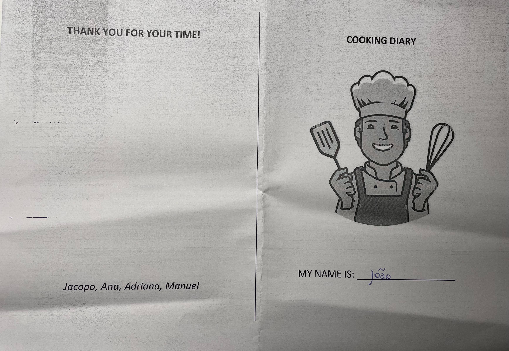
</p>

<p align="center">
  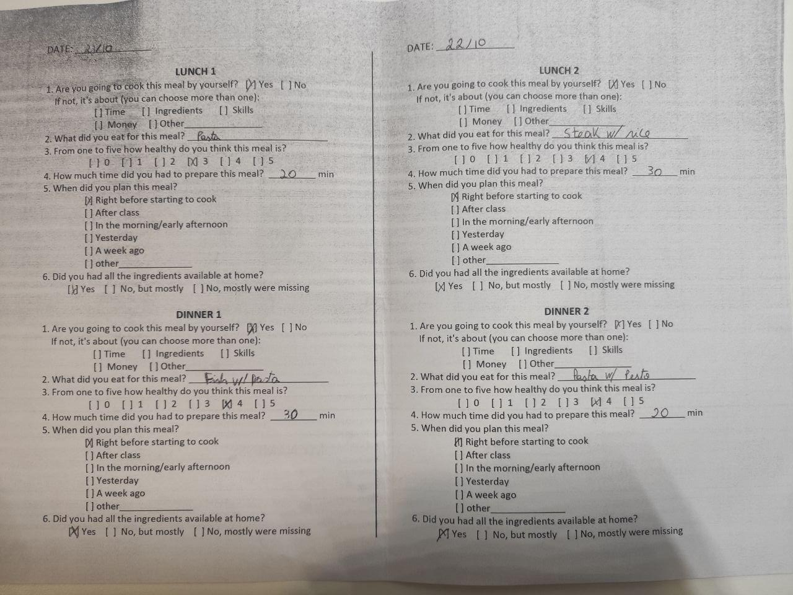
</p>

João spent on average 20 minutes cooking. He opted for quick and easy to do meals. We can see that he never planned his meals in advance but surprisingly, he didn't have a problem with missing ingredients. That's because he probably cooked based only on what he had available. We can also observe that pasta was, three times out of four, a central ingredient in his meals. However, he thinks that his meals were healthy enough.

### Paolo's diary
<p align="center">
  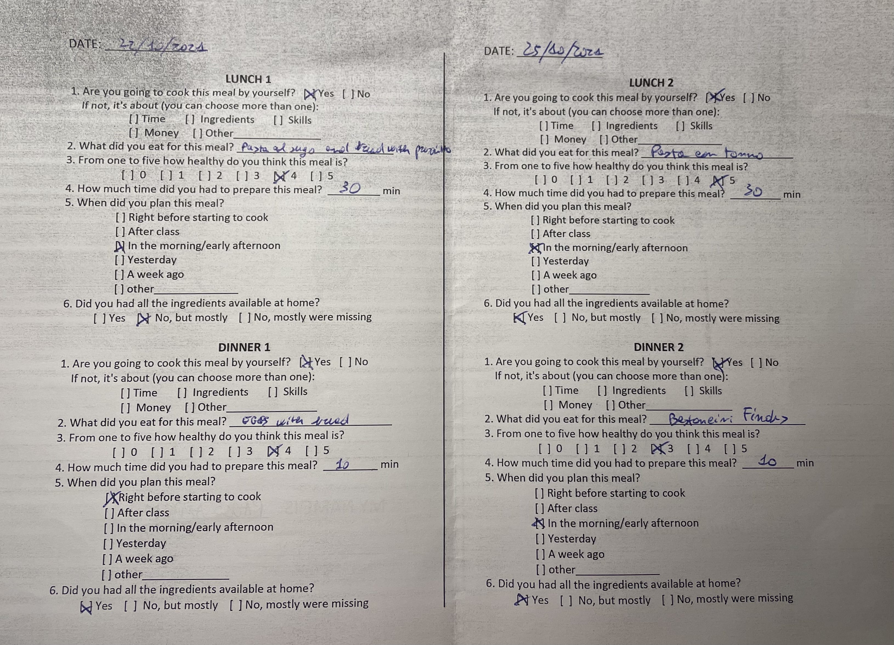
</p>

Paolo spent on average 20 minutes cooking. Except for one day, he had all the ingredients available at home, probably because he is good at organizing himself. For most meals, he chose what to eat in the morning. He had the perception that his dishes were quite healthy, even if he fried the ready-made frozen fish and he ate carbs in most of his meals.

### Alessia's diary
<p align="center">
  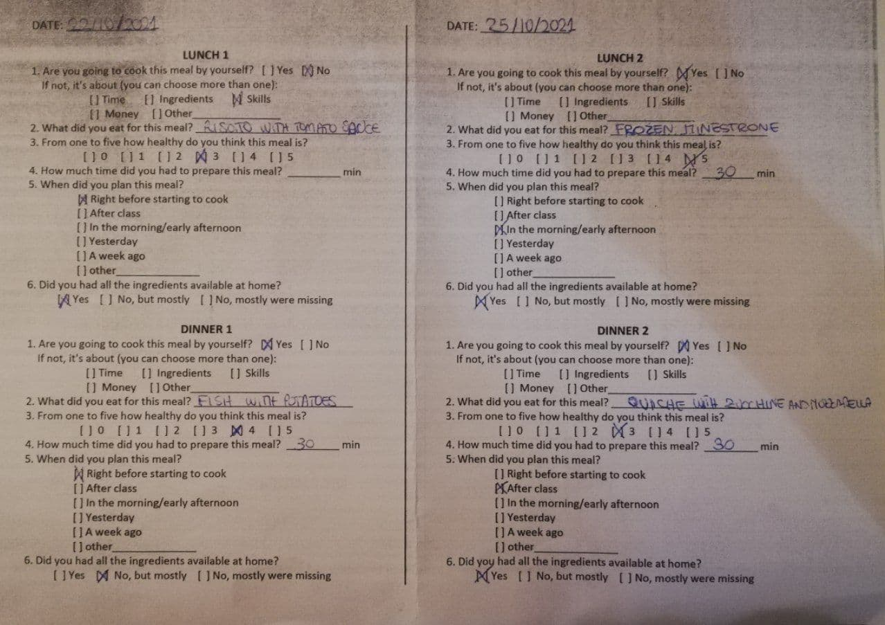
</p>
Alessia spent on average 30 minutes cooking. We can see that she doesn't plan her meals and decides what to eat just before starting to cook or a little earlier. She has most of the ingredients available at home, probably because she eats very simple meals with some ready-made ingredients. We can also see that for the first lunch she didn't prepare the meal by herself. Despite this, she believes that her preparations were quite healthy.

### Ramon's Diary

<p align="center">
  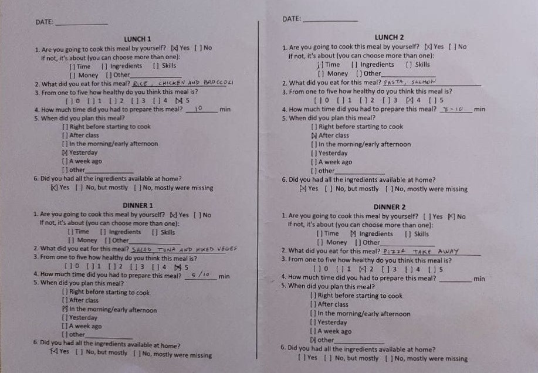
</p>

Ramon spent on average 10 minutes cooking. We can see that on the first day he planned what to eat in advance. On the second day, his decision to eat lunch happened right after class and he had a "take away pizza" for dinner. He had all the ingredients he needed available at home except for the second-day dinner. We can also see that he's used to cooking healthy food.


## User Needs
After interviewing the students we were able to identify several user needs:

1. Improve the variety of dishes prepared
2. Enhance their cooking skills
3. Recipes that take less time than ones online or in books 
4. Reduce wasted food
5. Healthier recipes

## Project Description
Our project will include the possibility to search for quick and simple recipes based on specific ingredients with attention to healthy meals.
Due to the ease and immediacy of use, our project will consist in a web application for smartphones.

# Milestone 2: Prototyping and Heuristics

## Storyboards

The storyboard represents a typical student day. At the beginning of the day, the student notices he has an old eggplant in the fridge. Later on, he starts to get hungry in classes and reminds himself that he should think about a way to cook that eggplant. Thus, on his way home, he searches for recipes with eggplant in the McHome app. At home, he finally decides on a quick recipe. In the end, he expresses his content with his experience. 

<p align="center">
  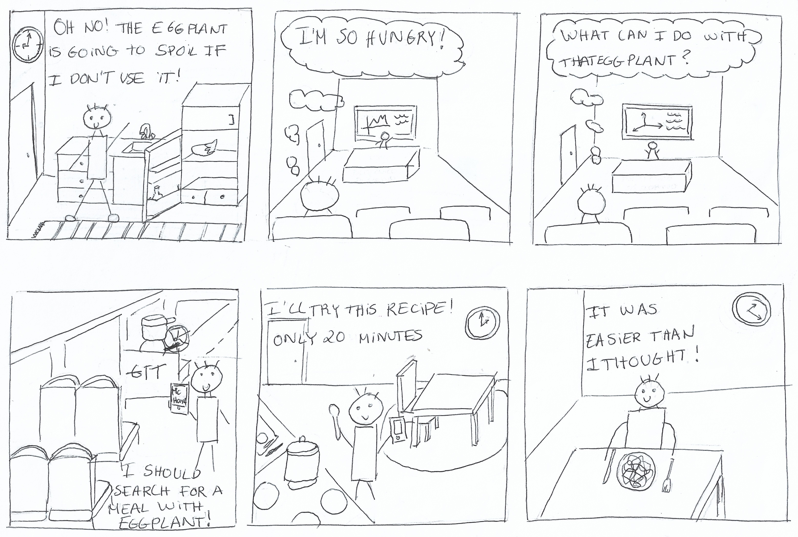<br/>
</p>

The storyboard highlights a common situation in a regular student day since they are our target user group. Moreover, it shows how the McHome app can be helpful for that. More specifically, it focuses on timesaving recipes, reducing waste food and easy recipes selection. The aforementioned is achieved by representing a student that wants to use an eggplant so it doesn't spoil and finds the solution for this problem with the McHome app. Besides that, he found an easy and timesaving recipe, two common demanded needs in student life. This gives the idea that it could be the reason he chooses those characteristics. 

Furthermore, the way he solved his problem highlights the easiness to incorporate the app into his daily life. Thus, we can say that this storyboard represents very well the user needs. 

We consider the strengths in this storyboard the following:
* Ability to correctly represent the user need
* Simple drawings that focus on the main goal instead of details

The weaknesses: 
* The storyboard shows a specific situation, which is when the ingredient is about to spoil. Our app can also be used in general situations, for example with an ingredient of user's choice


## Paper Prototypes

### Prototype 1

<p align="center">
  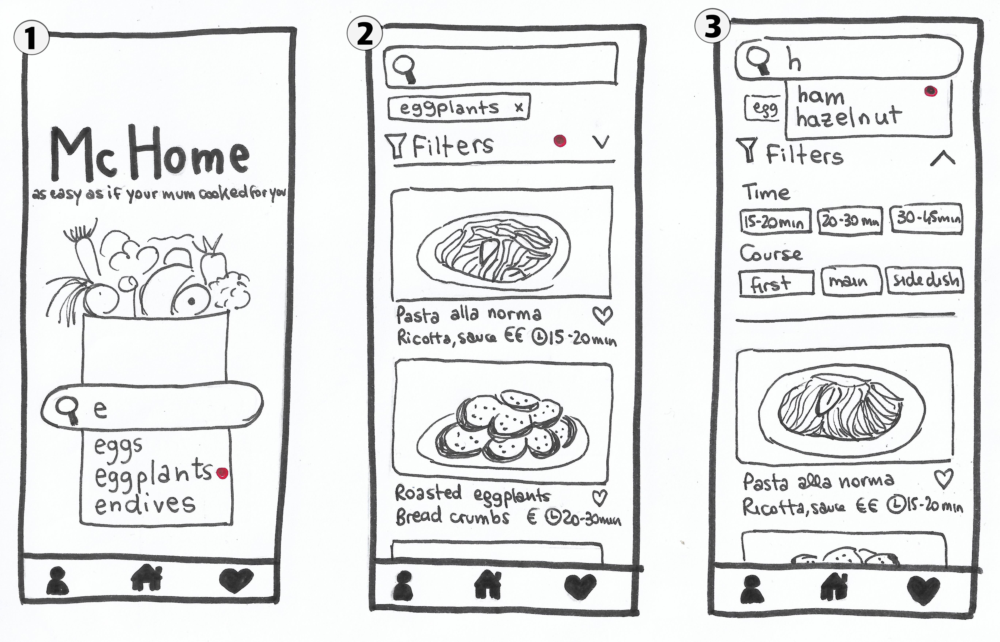<br/>
</p>

1. Main screen of the app. It is possible to search for an ingredient desired to be used for the meal
2. The scene displays a list of recipes that include the selected ingredient
3. It is possible to insert an additional ingredient, apply a filter or select a recipe

<p align="center">
  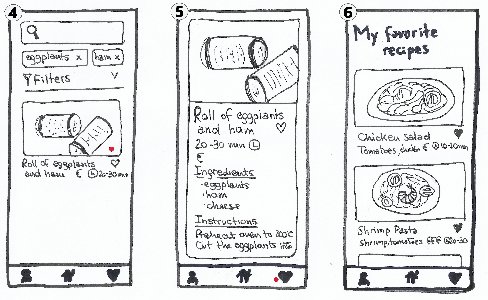<br/>
</p>

4. Looking for an additional ingredient, the list will update showing the recipes that meet the requirements
5. By selecting a recipe the user can read its details and also add them to his favourite ones
6. The favourites button at the bottom right of the navbar takes us to the list of the user's favourite recipes

The search for recipes based on an ingredient is the main feature of the application. Afterwards, starting from the choice of it, the user can refine the search by filtering, for example, based on the time he has available for the preparation of the dish.
The application is easy to use and can be used anywhere, even on the bus home. The favourite recipe list allows the user to quickly find a recipe he loves.

### Prototype 2

<p align="center">
  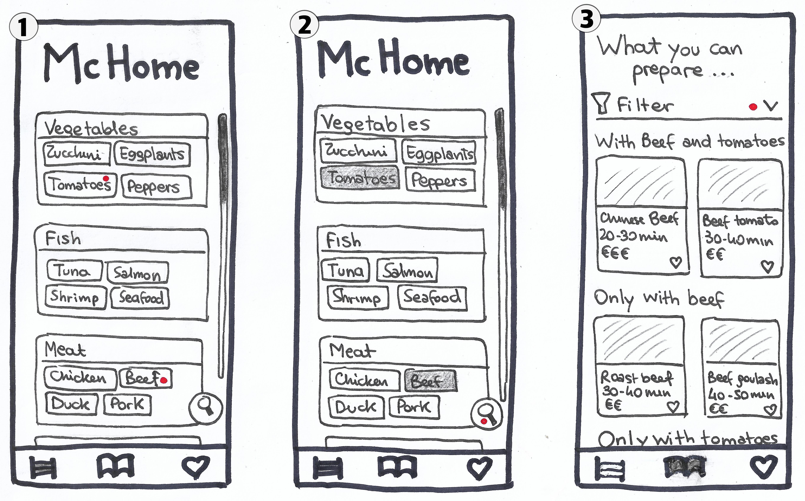<br/>
</p>

1. The main screen is shown with a list of food subcategories, along with some possible choices
2. It is possible to choose by touching one or more ingredients 
3. By searching, the list of recipes that meet the requirements is shown. At the bottom of the list are also shown the recipes with only some of the selected ingredients

<p align="center">
  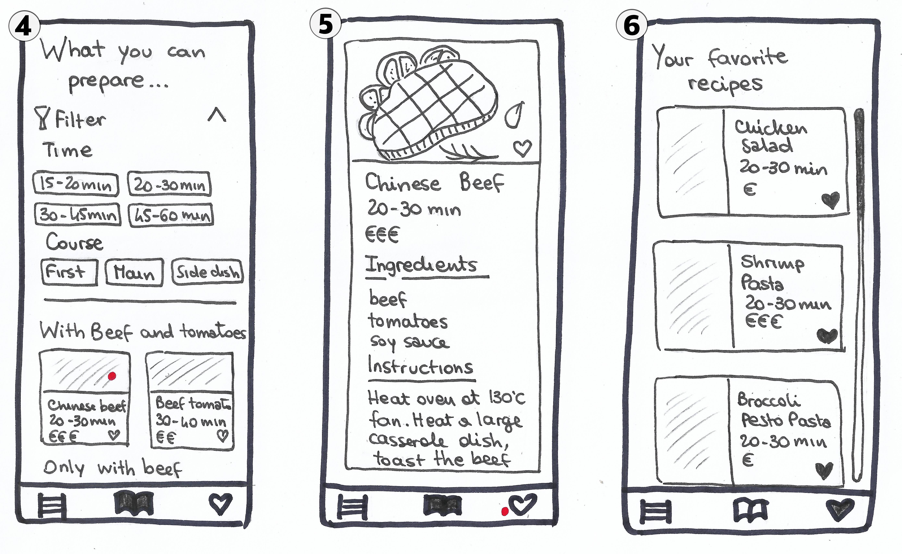<br/>
</p>

4. It is possible to apply a filter to show only recipes that meet certain requirements, such as the course one
5. By selecting a recipe the user will find more details and the possibility to add the recipe to his favourites
6. The last icon of the navbar, the one in the shape of a heart, takes the user to the list of his favourite recipes

This second prototype of the app helps the user with the recipe choice showing a list of predefined ingredients. In this way, he can discover new ingredients that he may not have previously considered. The recipes that meet the requirements are shown clearly, with an addition of a few that consider only some of the ingredients inserted, to increase the possibilities of choice. Filtering recipes are quick and easy, as is browsing his favourites list.

### Final thougths
While the two applications are different in terms of graphics, both have the same purpose: to start from some ingredients available in the student's fridge, to show some easy-to-prepare recipes.

The first one focuses on the search for a single ingredient that can be refined later by adding some others or using filters. It is immediate and simple to use, designed to be used quickly on the way home or in the classroom.

The second prototype has a higher level of detail right away, allowing the student to choose more than one ingredient for his research from a proposed list. Even if it is less immediate at first look, in this way it could help the student in the construction of the recipe, offering him a way to vary his diet more.

How the details of the recipe are shown is almost similar between both, as well as the possibility to apply filters or display the favourite recipe list. The final result is the same: a recipe that meets his time, budget and course requirements, while also allowing him to empty his fridge.


## Heuristic Evaluation
For the heuristic evaluation, we used the paper prototypes shown previously, appropriately cropped to simulate user actions. We recreated the dynamic changes of the screens so that the evaluators had a close experience to a real user experience.

<p align="center">
  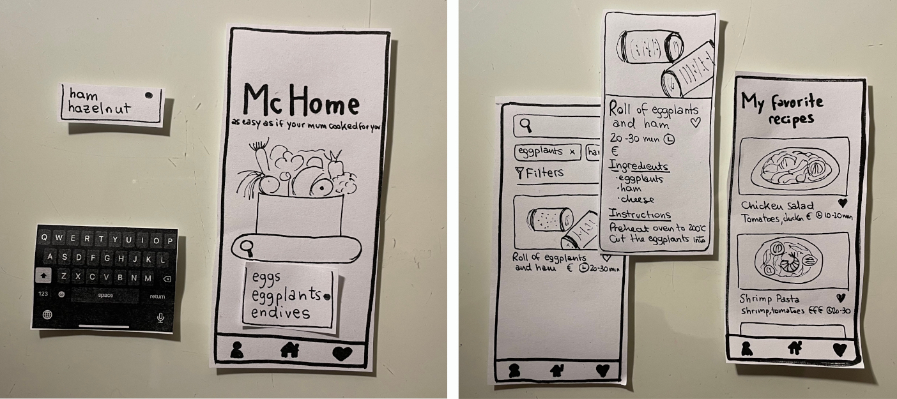<br/>
  <em>Prototype 1 pictures taken by the facilitator during the evaluation</em>
</p>

<p align="center">
  <br/>
  <em>Prototype 2 pictures taken by the facilitator during the evaluation</em>
</p>

The evaluators were able to test the application, noticing some shortcomings in terms of usability that we had not considered before.

To achieve this, the facilitator started by briefly explaining the idea of our application to the evaluator. She also proposed to the evaluators to analyse the situation as like they were off-site students since it is the target group of our application. Then it proceeded to simulate an experience for both prototypes while explaining the actions. 

A simulation of how it was conducted by the "facilitator" group member and the "computer" member can be seen live in these two youtube videos:

<div align="center">
  <a href="https://www.youtube.com/watch?v=Bi46CBUsHRU"></a> <a href="https://www.youtube.com/watch?v=fB-Jfc9AQ5k"></a>
</div>
<br/>
Furthermore, the facilitator has taken note of some relevant changes to apply to our initial idea, especially to make it clearer and easier to use.
<br/><br/>

Our evaluators were Dario and Caterina from the "PlanB" group. One of the main problems they pointed out, concerns the user's difficulty in returning to the previous screen to change his search choice. They also noticed that it is not clear what is required to search for at the beginning, whether a recipe or an ingredient. 

After carefully thinking through the recommendations in the evaluation made we decided that focusing on improving the first prototype would be the best option for our project. We made this decision because this version had what we consider a crucial feature for the usage by the target group: it can be used quickly and easily wherever the person is.

To achieve this, we come up with a list of potential changes to improve it:
* Add a clear explanation of what can be searched in the homescreen search bar (issue 1)
* Add a breadcrumb component to provide the user with a clear way to understand where they are (issue 2)
* Modify the visual appearance to better guide the user to add more ingredients to the recipes list page (issue 3 and issue 6)
* Add back button in the recipes' pages to go back to the search page to improve navigation in the app (issue 5)

By implementing these changes the user will be able to use the application in an even more immediate way.

# Milestone 3: Wireframe 

## Wireframe

For the creation of the medium-fidelity prototype, of our web application for mobile devices, we chose to use the prototyping tool [Figma](www.figma.com). It allowed us simply and immediately to create two connected screens shown below.


<p align="center">
  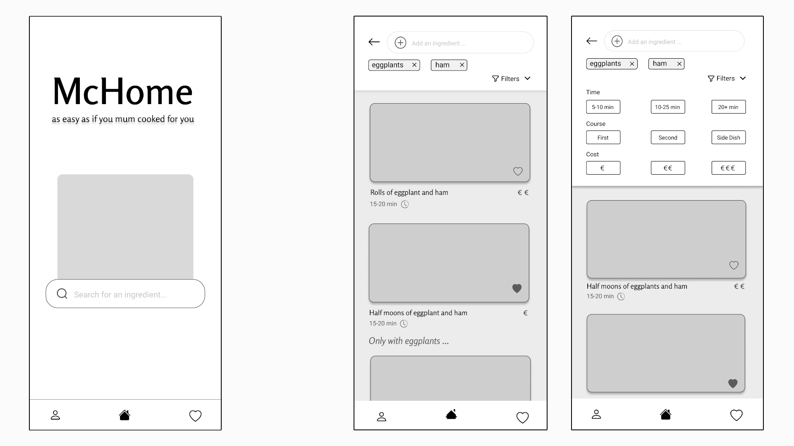<br/>
</p>


In addition to the home screen, we have decided to show a second page containing the search result by ingredients with recipes that meet the requirements. We have chosen this screen because the resulting recipes are the main functionality of our application, and must be able to be consulted easily wherever the user is. We also created a second version of that screen, with the filter bar open to show all features.


Following the analysis of the evaluators carried out during M2, in the prototype we have decided to show those main changes:
Make it clearer what can be searched for by using the search bars, both on the homepage and the screen showing the resulting recipes
A more consistent way to return to the main screen to start the search for a new recipe

# Milestone 4: Usability Testing

## Overview and Script

This test aims to evaluate the usability of the McHome web application from the perspective of an offsite university student. The five users that will perform the usability testing will be screened to ensure that they are between 19 and 25 years old and enrolled in a bachelor's or master's degree. They should have poor or basic cooking skills and already experience using smartphones.

Because of the actual pandemic situation, we will conduct the tests on Zoom. We will provide participants with links for the call and use our computer with the web application already open and working in a mobile simulator to take the test. They will share their webcam while they interact with our shared screen. The test evaluation will include a post-test questionnaire.

The test objectives for the usability study are to evaluate the website relative to the user's ability to:

- Search for a recipe by an ingredient
- Refine the search by adding another ingredient
- Add a recipe to the favorites and browse them

More details can be found in the usability testing protocol, including the script, [at this link.](https://github.com/include-jacopo/McHome/tree/main/additional_files/usability_testing_protocol.md)

## Results and List of Changes

In the next section we report our results, noticed elaborating the notes taken during the usability test, and impressions, obtained from the quick debrief we had with the participants at the end of the session. We then analyze the times taken for the tasks that required it and the results of the post-test questionnaire. Finally, we will illustrate a list of possible changes.

### Success and pain points
The first user to test the McHome app was Paolo. During his trial, we noticed that in the task "Filter recipes based on a medium budget" the buttons to filter the cost in the dropdown menu were not very explanatory, as the user did not immediately understand the correspondence (Medium cost)->(€€). Beyond this, he had no particular difficulties using the application and enjoyed it.


Erika was the second user who tested our app. She used the app smoothly from the start, showing no difficulty in solving tasks. This easiness may happen since Erika told us that she is very comfortable with social networks and smartphone applications during her recruitment. This way, she may have found a common thread with our app, and we are pleased about this.


The third user was Alessia. She found the application very easy to use and really liked that she could filter recipes based on the budget and how much time she spent cooking. Since she is a creature of habit, she said that she would use the "favorite recipes" feature a lot.
A problem highlighted by Alessia was related to the repetition of recipes following the search: in fact, as we can see from the screenshot below, the "Eggplants Roll" recipe is shown both as a result of the search for recipes with "Eggplant" and "Ham", and also in the list of suggestion "All recipes with: eggplants". We thought of the second section as a possible help for students who may not have found recipes they like with other ingredients or filters they applied, but we also believe that the page should not display duplicate recipes with the first section.


In the fourth test, Chiara could use the app without any additional help. She explained that she would use the application frequently, but she would like some suggested recipes displayed on the main screen to get some inspiration. She also added that an older user might not successfully search for recipes by ingredients. Instead, they would try to search directly by the recipe's name according to some websites about cooking. Nevertheless, we believe that in the search bar, it is well specified that you have to start from an ingredient, not from a recipe. Precisely for this reason, showing example recipes on the main page can be equivocal.


The fifth and final test with João was successful. He was able to complete all the tasks without significant missteps. At the end of the testing, João gave feedback that we would appreciate that the filter window would close automatically after applying one filter. However, since we want to allow users to apply more than one filter at once, we decided to leave that feature.


### Evaluation findings
After testing the five users, all candidates could complete all tasks effortlessly on their own. The tasks for which the success criterion required recording times are the following:

| #                | Task 1 (25 sec) | Task 2 (20 sec) | Task 3 (20 sec) |
| ---------------- | --------------- | --------------- | --------------- |
| Paolo R.      | 20 sec ✅       | 18 sec ✅       | 13 sec ✅       |
| Erika M.  | 11 sec ✅       | 10 sec ✅       | 5 sec ✅        |
| Alessia M.  | 20 sec ✅       | 7 sec ✅        | 7 sec ✅        |
| Chiara D.G. | 22 sec ✅       | 8 sec ✅        | 4 sec ✅        |
| João M.     | 10 sec ✅       | 16 sec ✅       | 19 sec ✅       |
| Average          | 16.6 sec        | 11.8 sec        | 9.6 sec         |

As can be seen, users could meet the limits set by the team in the definition phase. 

In the first task, we can see that two users scored near half the time as all the other users. One of the users was Erika, and she was consistent in scoring shorter times for all the tasks, which might imply a more experienced user. However, in João's case, the result might reflect that the user is used to experiencing a similar search feature in his daily life given the easiness of accomplishing this task compared to all the others. 

Another interesting observation is consistently scoring less time for most users with the tasks succession- Erika, Alessia, Chiara, and Paolo. Thus, the pattern might reflect system learnability with each previous task. 

In conclusion, all the users were able to meet the tasks time limits, with the last two tasks scoring a considerably smaller time amount than the defined time limit, which gives us confidence in our application usability.

The results of the Post-Test Questionnaire (SUS) are the following:

| #                | SUS score |
| ---------------- | --------- |
| Paolo R.      | 95        |
| Erika M.  | 100       |
| Alessia M.  | 95        |
| Chiara D.G. | 92,5      |
| João M.     | 100       |

The average score is 96.5. Our score is above the one needed to be considered an above-average result (68). Thus, these results reflect a positive perceived usability of the system by the testing users and contribute to a positive evaluation of our system usability. 

Analyzing the results more in detail, we can see that most users did not give the maximum score for the question "I think that I would like to use this system frequently". We believe it may be because students don't often go out of their comfort zone in the culinary field, as once they discover a new favorite recipe they tend to cook it often, but despite this everyone has had a positive reaction to the application and this for us it is already a success.


### List of potential changes
The changes we would like to make to our application are the following:

- Buttons to filter by cost could be modified as "Low €", "Medium €€" and "High €€€" to explain the symbol/cost correspondence better. This problem arose first from Paolo's interview, and subsequently, the other users also had hesitations.
- On the results page, when the user adds an additional ingredient or filters, a second section containing recipes with only the first ingredient entered is shown. We implemented this both because the list may be too short, and to give some suggestions to the user. However, we do not believe that it is consistent to show duplicate results between the two sections even if correct, and we will change this behavior of the application. We first noticed this during the Alessia's interview.

Both changes will be reflected in the final version of the app. 


